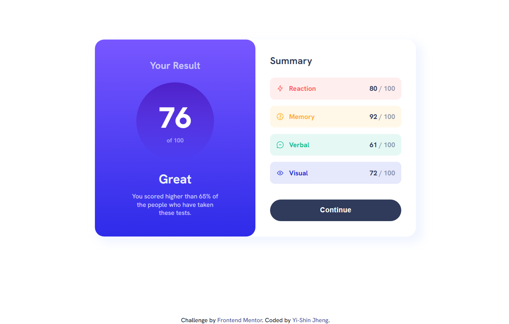

# Frontend Mentor - Results summary component solution

This is a solution to the [Results summary component challenge on Frontend Mentor](https://www.frontendmentor.io/challenges/results-summary-component-CE_K6s0maV). Frontend Mentor challenges help you improve your coding skills by building realistic projects.

## Table of contents

- [Overview](#overview)
  - [The challenge](#the-challenge)
  - [Screenshot](#screenshot)
  - [Links](#links)
- [My process](#my-process)
  - [Built with](#built-with)
  - [What I learned](#what-i-learned)
- [Author](#author)


## Overview

### The challenge

Users should be able to:

- View the optimal layout for the interface depending on their device's screen size
- See hover and focus states for all interactive elements on the page

### Screenshot



### Links

- Solution URL: [Result Summary Component Solution Page]([https://your-solution-url.com](https://www.frontendmentor.io/solutions/results-summary-component-with-rwd-j65RzeSkMX))
- Live Site URL: [Result Summary Component Live Demo](https://results-summary-comp-yishin.netlify.app/)

## My process

### Built with

- Semantic HTML5 markup
- CSS custom properties
- Flexbox
- CSS Grid
- Desktop-first workflow

### What I learned

I found that the `transition` property did not work with `background-image`.

```css
background-image: linear-gradient(
  to bottom,
  rgb(120, 87, 255),
  rgb(46, 43, 233)
);
```

There are a lot of solution for this problem in internet. The solution I choose is using pseudo element. It is the most simple solution I tried so far. Some people say that we can transition `background-image` on Google Chrome, however this feature is not supported by other browser.

```css
.btn::after {
  content: "Continue";
  position: absolute;
  top: 0;
  left: 0;
  width: 100%;
  padding: 1.4rem;
  border-radius: 99px;
  opacity: 0;
  transition: all 0.3s;

  background-image: linear-gradient(
    to bottom,
    rgb(120, 87, 255),
    rgb(46, 43, 233)
  );
}

.btn:hover::after {
  opacity: 1;
  cursor: pointer;
}
```

## Author

- Website - [Yi-Shin Jheng](https://github.com/Yishin-Jheng)
- Frontend Mentor - [@Yishin-Jheng](https://www.frontendmentor.io/profile/Yishin-Jheng)
